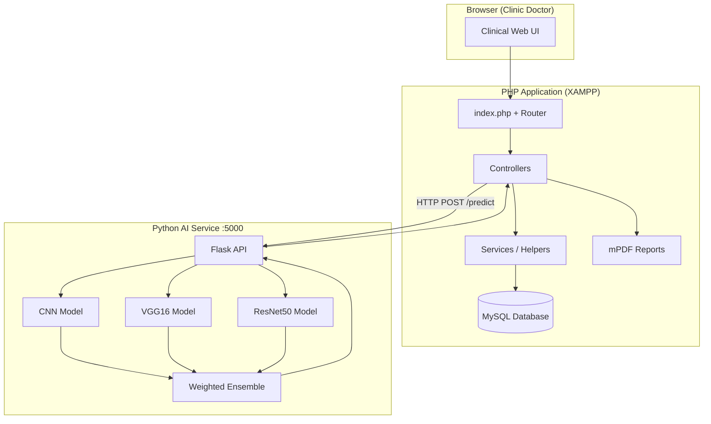

# OphthaMind AI — Eye Disease Classification System

**Final Year Project (FYP) · Bachelor of Computer Science (Software Development)**  
**Author:** [Aman Safwan](https://github.com/AmanSafwan) · Malaysia

A full-stack **clinical decision support web application** for ophthalmology screening. The system accepts fundus (retinal) images, runs a **deep learning ensemble** of three convolutional neural networks, and presents structured results to clinic doctors through a secure, audit-ready workflow.

> **Purpose:** Support—not replace—clinical judgement. AI outputs are logged, exportable, and intended for review by qualified healthcare professionals.

---

## Table of Contents

- [Overview](#overview)
- [Key Features](#key-features)
- [System Architecture](#system-architecture)
- [Machine Learning Approach](#machine-learning-approach)
- [Technology Stack](#technology-stack)
- [Screenshots & Demo](#screenshots--demo)
- [Requirements](#requirements)
- [Installation](#installation)
- [Configuration](#configuration)
- [Database Setup](#database-setup)
- [Running the Application](#running-the-application)
- [User Roles](#user-roles)
- [Project Structure](#project-structure)
- [API Reference](#api-reference)
- [Clinical PDF Reports](#clinical-pdf-reports)
- [Security & Compliance Notes](#security--compliance-notes)
- [Testing](#testing)
- [Troubleshooting](#troubleshooting)
- [Future Enhancements](#future-enhancements)
- [Acknowledgements](#acknowledgements)
- [License](#license)

---

## Overview

**OphthaMind AI** was developed as a Final Year Project to address the need for accessible, structured retinal screening tools in primary and community eye-care settings. The application combines:

- A **PHP web platform** for patient registry, clinician workflows, dashboards, and audit trails  
- A **Python Flask microservice** hosting three trained **TensorFlow/Keras** models  
- A **weighted ensemble fusion** strategy to improve prediction stability  
- **Professional PDF screening reports** suitable for clinical documentation  

The system classifies fundus images into **four ophthalmic categories** aligned with common screening pathways in Malaysia and internationally.

| Class | Clinical significance |
|-------|----------------------|
| **Normal** | No significant abnormality detected on screening |
| **Cataract** | Lens opacity pattern; vision impact assessment recommended |
| **Glaucoma** | Optic nerve / IOP risk pathway |
| **Diabetic Retinopathy** | Vascular retinal changes; diabetes care coordination |

---

## Key Features

### Clinical workspace (Clinic Doctor)
- **AI screening** — IC-based patient lookup, fundus upload, ensemble inference  
- **Personal dashboard** — KPIs, risk/diagnosis charts, recent screenings (scoped per clinician)  
- **Shared patient registry** — Search, filter, paginate ~30k+ demo records with realistic Malaysian naming  
- **Screening history** — Per-patient timeline with performing clinician, re-run, soft-delete  
- **PDF export** — A4 clinical report with embedded fundus image, ensemble breakdown, recommendations  

### Administration
- Admin dashboard shell (user management & analytics routes scaffolded)  
- Role-based access control with session validation against live database records  

### Platform quality
- Structured **audit log** with event codes and contextual metadata  
- Auto-start **AI service** on Windows (XAMPP) with health checks  
- Responsive **AdminLTE-based** clinical UI  
- `.htaccess` clean URLs  

---

## System Architecture



**Request flow (screening):**  
Clinician uploads fundus image → PHP stores file & patient link → PHP calls Flask `/predict` → ensemble result persisted → UI modal + history + optional PDF.

---

## Machine Learning Approach

### Models
Three independently trained deep learning models operate on **224×224 RGB** fundus images:

| Model | Role | Preprocessing |
|-------|------|---------------|
| **Custom CNN** | Primary feature extractor | Rescale ÷ 255 |
| **VGG16** | Transfer learning | `vgg16.preprocess_input` |
| **ResNet50** | Transfer learning | `resnet50.preprocess_input` |

### Ensemble fusion
Softmax outputs are combined using **fixed weights** for stability:

```
Final = (CNN × 0.30) + (VGG16 × 0.35) + (ResNet50 × 0.35)
```

Additional metrics returned:
- **Final confidence** — max ensemble probability  
- **Model agreement** — % of models agreeing on the top class  
- **Risk level** — Low / Medium / High mapping per diagnosis  

### Model files
Trained weights are stored under:

```
ai/models/cnn/cnn_final.keras
ai/models/vgg16/vgg16_final.keras
ai/models/resnet50/resnet50_final.keras
```

> Model binaries are excluded from Git due to size. See [`ai/models/README.md`](ai/models/README.md).

---

## Technology Stack

| Layer | Technologies |
|-------|-------------|
| **Frontend** | HTML5, CSS3, JavaScript (ES6), AdminLTE, Chart.js, Font Awesome |
| **Backend** | PHP 8+, custom MVC router, PDO |
| **Database** | MySQL / MariaDB |
| **AI / ML** | Python 3, Flask, TensorFlow/Keras, NumPy, Pillow |
| **PDF** | mPDF 8.x (Composer) |
| **Server** | Apache (XAMPP), mod_rewrite |

---

## Screenshots & Demo

> Add screenshots to `docs/screenshots/` for your portfolio and viva presentation.

Recommended captures:
1. Landing / clinician login  
2. AI screening workflow with result modal  
3. Personal dashboard (KPIs + charts)  
4. Patient registry with search  
5. PDF report sample  
6. Activity / audit log  

**Live demo URL:** *(optional — add after deployment)*

---

## Requirements

### Software
- **XAMPP** (Apache + PHP 8.0+ + MySQL)  
- **Composer** 2.x  
- **Python** 3.10+ with virtual environment  
- PHP extensions: `pdo_mysql`, `gd`, `zip`, `mbstring`  

### Hardware (minimum)
- 8 GB RAM (16 GB recommended for TensorFlow model loading)  
- CPU inference supported; GPU optional for faster training/inference  

---

## Installation

### 1. Clone the repository

```bash
git clone https://github.com/AmanSafwan/ophthamind-eye-disease-classification.git
cd ophthamind-eye-disease-classification
```

### 2. PHP dependencies

```bash
composer install
```

### 3. Python environment

```bash
python -m venv venv

# Windows
venv\Scripts\activate
pip install -r requirements.txt

# Linux / macOS
source venv/bin/activate
pip install -r requirements.txt
```

### 4. Environment file

```bash
copy .env.example .env
```

Edit `.env` for your MySQL port, credentials, and `APP_URL`.

### 5. Place trained models

Copy your `.keras` model files into `ai/models/` as described in [`ai/models/README.md`](ai/models/README.md).

### 6. Apache

- Point document root to the project folder (or place under `htdocs/eye_system`)  
- Enable **mod_rewrite**  
- Ensure `AllowOverride All` for `.htaccess`  

---

## Configuration

Key variables in `.env`:

| Variable | Description | Example |
|----------|-------------|---------|
| `APP_URL` | Public base URL (no trailing slash) | `http://localhost/eye_system` |
| `DB_HOST` | MySQL host | `127.0.0.1` |
| `DB_PORT` | MySQL port | `3307` (XAMPP custom) or `3306` |
| `DB_NAME` | Database name | `eye_system` |
| `DB_USER` / `DB_PASS` | Credentials | `root` / empty |
| `PYTHON_PATH` | Path to venv Python | `venv\Scripts\python.exe` |
| `SESSION_TIMEOUT` | Idle timeout (seconds) | `3600` |
| `ENABLE_REGISTRATION` | Public self-registration | `false` |

The database layer auto-fallback tries ports **3307** then **3306** if the primary port fails.

---

## Database Setup

1. Create the database:

```sql
CREATE DATABASE eye_system CHARACTER SET utf8mb4 COLLATE utf8mb4_unicode_ci;
```

2. Import your schema / seed data (provided separately for FYP submission or generate via project scripts under `scripts/database/`).

3. Optional performance indexes:

```bash
mysql -u root -P 3307 eye_system < scripts/database/dashboard_indexes.sql
```

4. Role migration (if upgrading):

```bash
mysql -u root -P 3307 eye_system < database/migrate_role_clinic_doctor.sql
```

**Core tables:** `users`, `patients`, `predictions`, `audit_logs`

---

## Running the Application

### Web application
Start **Apache** and **MySQL** in XAMPP, then open:

```
http://localhost/eye_system
```

### AI microservice

**Option A — Manual start**

```bash
venv\Scripts\activate
python ai_api\app.py
```

Or run `start_flask.bat` on Windows.

**Option B — Auto-start**  
The PHP app attempts to launch the AI service in the background when a screening is requested. Logs: `writable/logs/ai_service.log`

**Health check:** `http://127.0.0.1:5000/health`

---

## User Roles

| Role | Database value | Access |
|------|----------------|--------|
| **Clinic Doctor** | `clinic_doctor` | Screening, dashboard, registry, history, PDF |
| **System Administrator** | `admin` | Admin modules (dashboard, users, analytics) |

Sessions are validated on every protected request — deleted accounts are immediately signed out.

---

## Project Structure

```
eye_system/
├── app/                         # Application code (MVC)
│   ├── Config/Routes.php        # Route definitions (CI4-style)
│   ├── controllers/             # Auth, Admin, Ophthalmologist
│   ├── core/                    # Router, base Controller
│   ├── helpers/                 # Audit, Diagnosis, Role, Nav, …
│   ├── middleware/              # Session & role enforcement
│   ├── models/                  # Patient model
│   ├── services/                # AI manager, analytics, PDF
│   └── views/                   # Templates & layouts
├── public/                      # Web-accessible static files
│   ├── assets/                  # CSS, JS, AdminLTE
│   └── upload/                  # Fundus images (runtime)
├── writable/                    # Logs, cache, hosting lock
├── config/                      # app.php, db.php, ai_models
├── database/                    # Migrations & maintenance CLI
├── scripts/                     # Seeding, eval, deploy tools
├── ai_api/app.py                # Production Flask AI (port 5001)
├── ai/models/                   # Trained .keras weights (not in Git)
├── deploy/                      # Hosting package templates
├── index.php                    # Front controller (XAMPP entry)
├── composer.json
├── requirements.txt
└── .env.example
```

Full route map: [`app/Config/Routes.php`](app/Config/Routes.php)

---

## API Reference

### AI service (Flask — `127.0.0.1:5000`)

| Method | Endpoint | Description |
|--------|----------|-------------|
| GET | `/health` | Service health check |
| POST | `/predict` | Multipart image → ensemble JSON |

### Web application (selected routes)

| Method | Route | Description |
|--------|-------|-------------|
| GET/POST | `login` | Authentication |
| GET | `ophthalmologist/dashboard` | Personal analytics dashboard |
| GET | `ophthalmologist/predict` | AI screening workspace |
| POST | `ophthalmologist/predict` | Run inference |
| POST | `ophthalmologist/checkIC` | Patient IC lookup |
| POST | `ophthalmologist/patientData` | Registry AJAX table |
| GET | `ophthalmologist/exportPDF` | Download screening PDF |
| GET | `ophthalmologist/history` | Clinician activity log |

Full route map: [`app/Config/Routes.php`](app/Config/Routes.php)

---

## Clinical PDF Reports

Screening PDFs are generated with **mPDF** and include:

- Patient identification & screening metadata  
- Embedded fundus photograph  
- Ensemble summary (diagnosis, confidence, risk, agreement)  
- Per-model breakdown (CNN / VGG16 / ResNet50)  
- Clinical interpretation & suggested follow-up interval  
- Signature blocks for validating clinicians  

Export: **History → PDF** or post-screening download link.

---

## Security & Compliance Notes

- Passwords hashed with PHP `password_hash()` (bcrypt)  
- Role-based middleware on all clinical routes  
- Session invalidation when user records are removed  
- Audit trail for authentication, screening, patient edits, PDF export  
- **Not production-hardened** — intended for FYP demonstration; deploy with HTTPS, secrets management, and formal clinical validation before any real patient use  

---

## Testing

Smoke test (file structure + HTTP routes):

```bash
php database/smoke_routes.php --http
```

Manual checklist:
- [ ] Login as clinic doctor  
- [ ] IC search on Predict page  
- [ ] Upload fundus image → receive ensemble result  
- [ ] Dashboard KPIs populate  
- [ ] Patient registry search/pagination  
- [ ] PDF download  
- [ ] Logout invalidates session  

---

## Troubleshooting

| Issue | Solution |
|-------|----------|
| `DB Connection Failed` | Verify MySQL is running; check `DB_PORT` in `.env` (3307 vs 3306) |
| `AI service unavailable` | Run `python ai_api\app.py`; check `writable/logs/ai_service.log` |
| `Model not found` | Place `.keras` files under `ai/models/` |
| PDF fails | Run `composer install`; enable PHP `gd` and `zip` |
| Blank dashboard charts | Sign in again; ensure API routes return JSON (not login HTML) |
| PHP extension errors | Enable `extension=gd` and `extension=zip` in `php.ini` |

---

## Future Enhancements

- Grad-CAM / saliency overlays for explainable AI  
- Left/right eye metadata and DICOM import  
- Multi-clinic tenancy and HL7/FHIR integration  
- Mobile-responsive PWA for rural screening camps  
- Formal clinical validation study & sensitivity/specificity reporting  
- GPU-optimised inference server (TensorFlow Serving / ONNX)  

---

## Acknowledgements

Developed as a **Final Year Project** in **Bachelor of Computer Science (Software Development)**, Malaysia.

- Academic supervisors and faculty reviewers  
- Open-source communities: AdminLTE, mPDF, TensorFlow, Flask  
- Malaysian patient naming & registry patterns for realistic demo data  

---

## License

This project is submitted as academic coursework. All rights reserved by the author unless otherwise agreed with the institution.

For portfolio or employer review enquiries, contact via [GitHub: AmanSafwan](https://github.com/AmanSafwan).

---

<p align="center">
  <strong>OphthaMind AI</strong> — Intelligent retinal screening for better eye care decisions.<br>
  <sub>Built with PHP · Python · TensorFlow · MySQL</sub>
</p>
